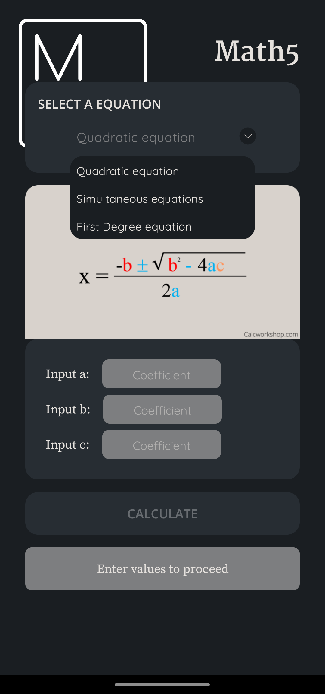
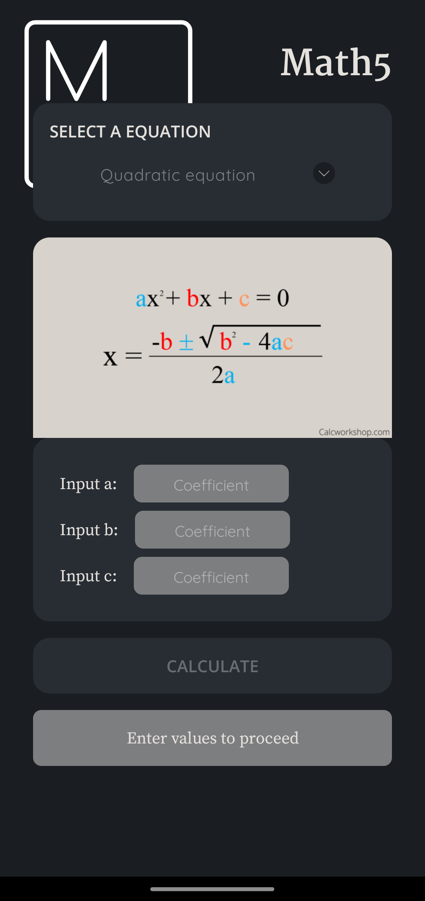
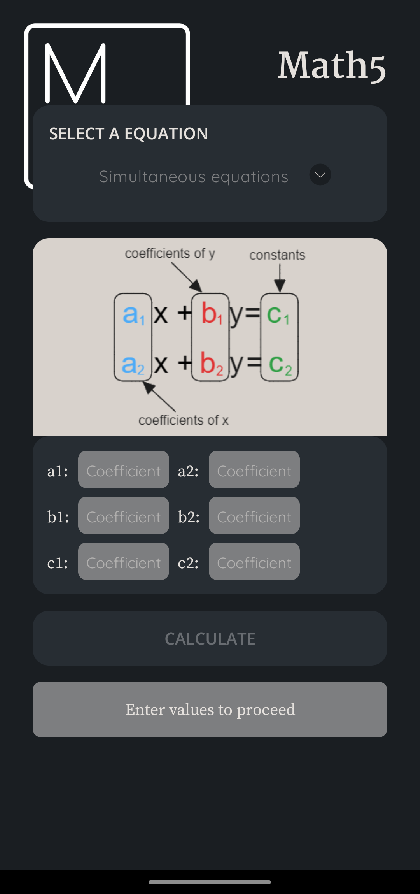
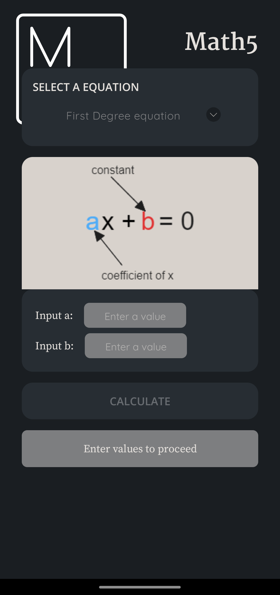
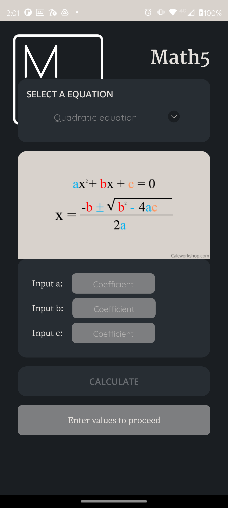
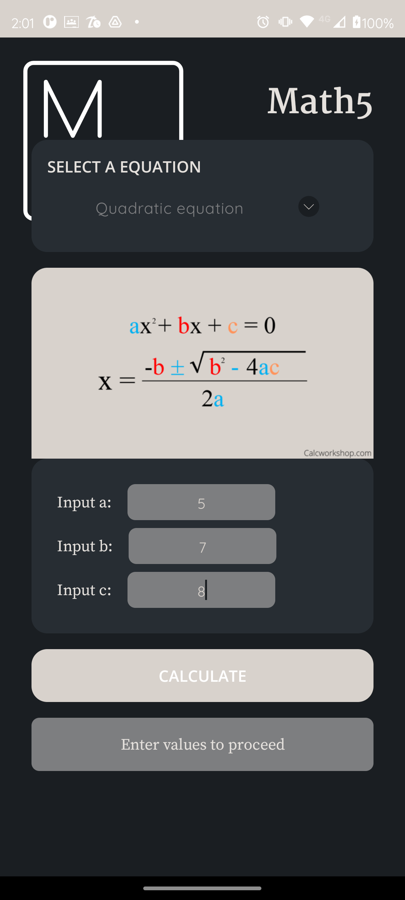
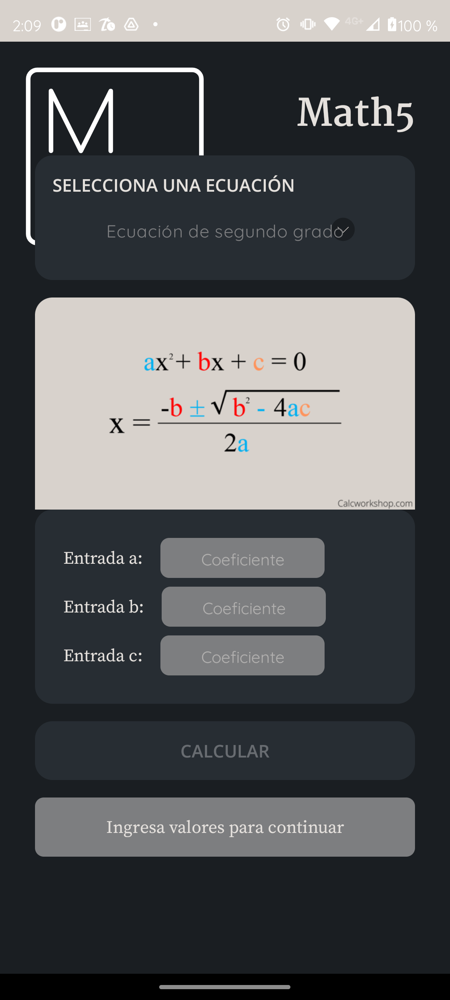

# Math5

## First project for the Mobile Devices course

This app uses a `<Spinner>` element to switch between three different formulas based on the user's choice. Each formula has its own associated `View's`, allowing the user to interact with them to perform calculations based on the input data.

## Design

### Splashscreen

### Spinner active

### Quadratic Equation

### Simultaneous Equation

### First degree Equation

## Validations

The 'CALCULATE' button is disabled until all fields are filled, also error messages are displayed in the bottom `TextView` element.

## Language Support

The app is available in English and Spanish.

## Demonstration video

https://drive.google.com/file/d/1OXmtd4PnP4XXbsLiEjVI5epNNZ_uGIWu/view?usp=sharing

Made by Leonardo Cruz